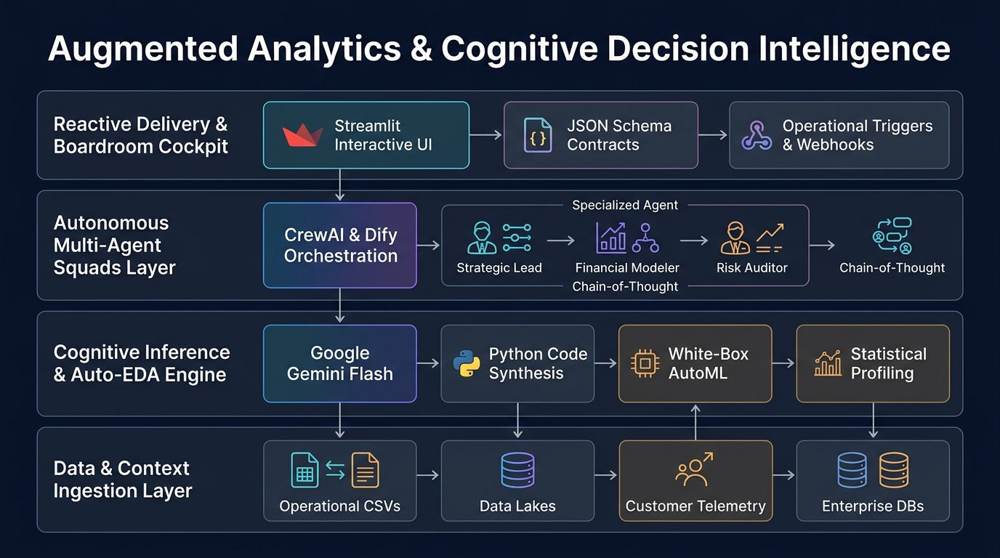
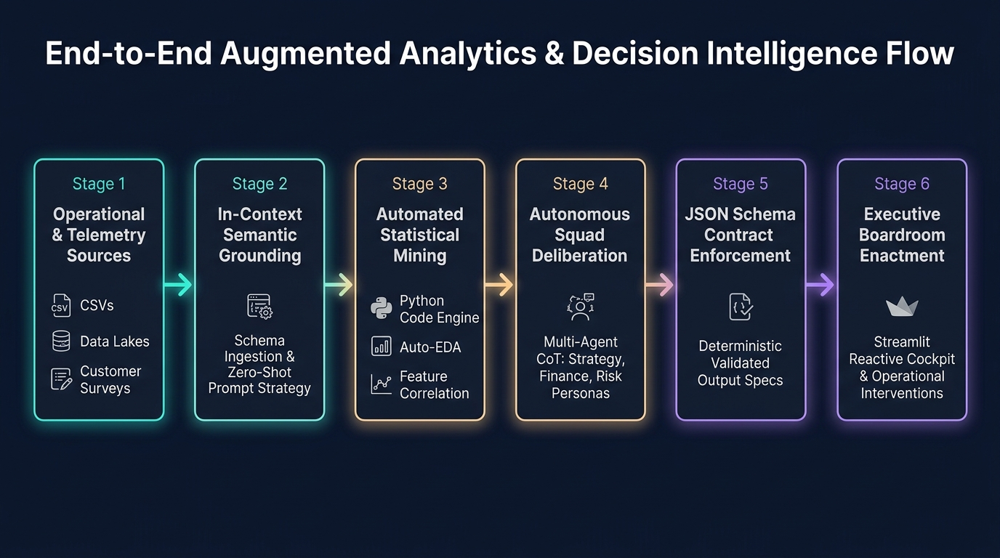

# Enterprise Augmented Analytics & Cognitive Decision Intelligence Blueprint
> Reference Architecture, Autonomous Agentic Workflows, and Hands-on Labs for Next-Generation Business Intelligence.

[](https://www.fiap.com.br/mba/mba-em-business-intelligence-e-strategic-insights/)


-lightgrey.svg)



---

## 🎯 Executive Overview & The Paradigm Shift

Enterprise business intelligence stands at an inflection point. For the past two decades, organizations invested billions into descriptive data warehousing and visual analytics suites. However, modern corporate leadership is now reckoning with the **Reactive Dashboard Obsolescence Paradox**:

```
Traditional Descriptive BI (Lagging)             Augmented Cognitive Decisioning (Leading)
┌──────────────────────────────────────┐         ┌──────────────────────────────────────────────┐
│  • Siloed SQL & Static KPI Cards     │         │  • Dynamic In-Context Semantic Grounding     │
│  • Human Cognitive Overload          │  ───►   │  • Autonomous Auto-EDA & Anomaly Mining      │
│  • Post-Mortem Diagnostic Latency    │         │  • Multi-Agent Chain-of-Thought Deliberation │
│  • Zero Prescriptive Action Capacity │         │  • Contract-Driven Enactment (JSON / APIs)   │
└──────────────────────────────────────┘         └──────────────────────────────────────────────┘
```

Static dashboards have become visual graveyards of historical telemetry. Business stakeholders are burdened with manually filtering cross-tabular views to answer *what happened*, while the critical executive questions—*why did it happen*, *what will happen next*, and *which operational levers should be pulled immediately*—remain unanswered.

This repository serves as the official enterprise reference blueprint and laboratory suite for the **[MBA em Business Intelligence e Strategic Insights](https://www.fiap.com.br/mba/mba-em-business-intelligence-e-strategic-insights/)** at **FIAP**. It bridges modern cognitive technologies (**Google Gemini Flash**, **Multi-Agent Orchestration**, and **Contract-Driven UI**) to engineer proactive, self-driving decision systems.

### The Four Architectural Pillars:

1. **Semantic Context Grounding & In-Context Inference:** Bypassing brittle natural-language-to-SQL (NL2SQL) pipelines through direct multimodal grounding. By ingesting raw operational and behavioral schemas directly into LLM context windows with zero loss of semantic nuances, analysts extract deep diagnostic signals without writing repetitive extraction queries.
2. **White-Box Automated Feature Discovery & Diagnostics:** Eliminating the black-box opacity of traditional AutoML. Utilizing LLMs as autonomous code-generating agents capable of executing statistical profiling, outlier isolation, feature synthesis, and machine learning pipelines in open Python environments (`pandas`, `scikit-learn`, `altair`).
3. **Autonomous Multi-Agent Deliberation & Chain-of-Thought (CoT):** Decomposing complex strategic decisions (e.g., M&A synergy, churn mitigation, risk underwriting) across specialized agentic squads. Roles including Lead Strategic Analyst, Financial Modeler, Customer Success Auditor, and Compliance Officer collaborate asynchronously to deliberate, challenge assumptions, and synthesize consensus.
4. **Contract-Driven Enactment & Reactive Interfaces:** Bridging probabilistic AI generation with deterministic production downstream. Leveraging structured JSON Schemas, strict Pydantic parsing, and reactive interfaces (`Streamlit`) to trigger real-world business workflows, CRM webhooks, and executive-ready decision cockpits.

---

## 🏗️ End-to-End Architectural Flow



### Lifecycle Architecture Matrix

| Stage | Architectural Phase | Domain Responsibility & Core Actions | Standards & Technology Stack | Production Guarantees & Deliverables |
| :---: | :--- | :--- | :--- | :--- |
| **0** | **Operational & Telemetry Sources** | Aggregation of raw enterprise telemetry, tabular survey CSVs, and transactional ledgers. | Pandas, CSV, Enterprise DBs, Data Lakes | Immutable raw source datasets (`PesquisaClientes.csv`, `50_Startups.csv`) |
| **1** | **In-Context Semantic Grounding** (Labs 01 & 03) | Contextual schema injection, persona calibration, and multi-dataset cross-referencing without brittle NL2SQL pipelines. | Google AI Studio, Google Gemini Flash, System Instructions | Grounded semantic extraction, zero-hallucination diagnostic memos |
| **2** | **Statistical Mining & Auto-EDA** (Labs 02, 04 & 05) | Programmatic exploration, automated outlier surfacing, white-box feature synthesis, and machine learning modeling. | Python 3.10+, Pandas Native Agent, Scikit-Learn (Random Forest) | Interpretable White-Box code, SHAP values, portfolio allocation algorithms |
| **3** | **Multi-Agent Squad Deliberation** (Labs 06 & 07) | Collaborative decision synthesis across specialized agent personas (Strategic Lead, Financial Modeler, Risk Auditor). | CrewAI, LiteLLM, Dify.ai, Chain-of-Thought (CoT) | Multi-perspective strategic consensus, proactive retention protocols |
| **4** | **Contract Enforcement & Schemas** (Lab 08) | Constrained decoding and strict schema verification to guarantee deterministic JSON payloads for microservices. | JSON Schema, Pydantic, Constrained Decoding | Type-safe JSON payloads, automated API contract compliance |
| **5** | **Boardroom Enactment & Cockpits** (Labs 09 & 10) | Interactive reactive frontends, dynamic visualization, and human-in-the-loop operational trigger execution. | Streamlit, Plotly, Webhooks, Ngrok Tunneling | Deployable Executive Cockpit with autonomous trigger workflows |

---

## 🧪 Comprehensive 10-Module Enterprise Lab Suite

Each module is self-contained within its respective directory, featuring structured student walkthroughs (`Roteiro Aluno.md`), production datasets, and executable Jupyter Notebooks or Google AI Studio blueprints.

| Module | Lab Directory | Enterprise Challenge / Business Problem | Technical Architecture & Modern Stack | Key Executive Artifact & Delivery | Interactive Launch |
| :---: | :--- | :--- | :--- | :--- | :---: |
| **01** | [`lab01-cx-analytics/`](./lab01-cx-analytics/) | **Customer Experience (CX) Friction Isolation:** Mining unstructured customer sentiment and satisfaction drivers across multi-product portfolios. | Google AI Studio • Gemini Flash • Zero-Shot In-Context Learning | Executive CX Diagnosis Memo & Action Matrix | [Inspect Guide](./lab01-cx-analytics/Lab%2001%20-%20Roteiro%20Aluno.md) |
| **02** | [`lab02-financial-analytics/`](./lab02-financial-analytics/) | **Venture Capital Capital Allocation:** Evaluating operational burn rates, R&D intensity, and profitability across 50 tech startups. | Python 3.10+ • Pandas • Google GenAI SDK (Gemini Flash) | Algorithmic Investment Thesis & Portfolio Ranking | [](https://colab.research.google.com/github/rafaelmatsuyama/FIAP-BI-AugmentedAnalytics/blob/main/lab02-financial-analytics/Lab%2002%20-%20Colab%20Notebook.ipynb) |
| **03** | [`lab03-ma-synergy/`](./lab03-ma-synergy/) | **Cross-Context M&A Due Diligence:** Harmonizing disparate customer survey telemetry with financial startup ledger data to identify acquisition targets. | Google AI Studio • Dual-Context Grounding • Top-P/Temp Calibration | M&A Investment Committee Acquisition Memorandum | [Inspect Guide](./lab03-ma-synergy/Lab%2003%20-%20Roteiro%20Aluno.md) |
| **04** | [`lab04-pandas-agent/`](./lab04-pandas-agent/) | **Autonomous Data Exploration:** Replacing rigid ad-hoc SQL inquiries with a self-executing Python code-writing analytics agent. | Python • Google Colab • Pandas Native Agent • Dynamic Code Exec | Interactive Natural-Language Ad-Hoc Analytics Engine | [](https://colab.research.google.com/github/rafaelmatsuyama/FIAP-BI-AugmentedAnalytics/blob/main/lab04-pandas-agent/Lab%2004%20-%20Colab%20Notebook.ipynb) |
| **05** | [`lab05-automl-scikit/`](./lab05-automl-scikit/) | **White-Box Churn Predictor:** Automating feature transformation, model selection, and SHAP-based feature importance explainability. | Python • Scikit-Learn • Random Forest • White-Box Profiling | Interpretable Churn Prediction Model & ROC-AUC Report | [](https://colab.research.google.com/github/rafaelmatsuyama/FIAP-BI-AugmentedAnalytics/blob/main/lab05-automl-scikit/Lab%2005%20-%20Colab%20Notebook.ipynb) |
| **06** | [`lab06-dify-workflow/`](./lab06-dify-workflow/) | **Low-Code Enterprise Orchestration:** Constructing resilient multi-step analytical pipelines with human-in-the-loop validation checkpoints. | Dify.ai Enterprise • Visual Flow Orchestration • Tool Calling | Production-Grade Visual Analytical Pipeline | [Inspect Guide](./lab06-dify-workflow/) |
| **07** | [`lab07-crewai-squad/`](./lab07-crewai-squad/) | **Autonomous Operation Churn Zero:** Multi-agent autonomous squad orchestrating retention campaigns, discount modeling, and outreach drafting. | CrewAI • LiteLLM • Role-Based Multi-Agent Collaboration | Synthesized Retention Protocol & Task Delegation Flow | [](https://colab.research.google.com/github/rafaelmatsuyama/FIAP-BI-AugmentedAnalytics/blob/main/lab07-crewai-squad/Lab%2007%20-%20Colab%20Notebook.ipynb) |
| **08** | [`lab08-json-schema/`](./lab08-json-schema/) | **Deterministic Output Contracts:** Forcing LLMs to comply with strict, production-ready JSON schemas for microservice integration. | Google AI Studio • Constrained Decoding • JSON Schema | Validated Pydantic/JSON Microservice Interface Spec | [Inspect Guide](./lab08-json-schema/) |
| **09** | [`lab09-agentic-dashboard/`](./lab09-agentic-dashboard/) | **Reactive Executive Cockpit:** Building interactive, agent-driven analytical applications that generate insights dynamically on user input. | Streamlit • PyNgrok • Gemini Flash • Plotly Dynamic Charts | Deployable Interactive AI-Powered Executive Dashboard | [](https://colab.research.google.com/github/rafaelmatsuyama/FIAP-BI-AugmentedAnalytics/blob/main/lab09-agentic-dashboard/Lab%2009%20-%20Dashboard%20de%20Analytics.ipynb) |
| **10** | [`lab10-integracao-final/`](./lab10-integracao-final/) | **End-to-End Enterprise Solution Capstone:** Unifying ingestion, predictive modeling, multi-agent evaluation, and a reactive executive frontend. | Full Stack: Streamlit • Scikit-Learn • CrewAI • JSON Schema | Enterprise-Grade Decision Intelligence System | [](https://colab.research.google.com/github/rafaelmatsuyama/FIAP-BI-AugmentedAnalytics/blob/main/lab10-integracao-final/Lab%2010%20-%20Integração%20Final%20e%20Dashboard%20Estruturado.ipynb) |

---

## 🚀 Operational Execution Tracks

### Track A: Zero-Setup Cloud Execution (Recommended)
All notebook-centric modules (Labs 02, 04, 05, 07, 09, 10) are optimized for **Google Colaboratory**:
1. Click the corresponding **"Open in Colab"** badge in the matrix above.
2. Store your API Key securely in Colab Secrets:
   ```python
   from google.colab import userdata
   api_key = userdata.get('GEMINI_API_KEY')
   ```
3. For semantic and prompt-centric labs (Labs 01, 03, 08), launch directly via [Google AI Studio](https://aistudio.google.com/) using the provided system personas.

### Track B: Local Enterprise Production Setup
For teams running local development workflows or self-hosting dashboards:

```bash
# 1. Clone the repository
git clone https://github.com/rafaelmatsuyama/FIAP-BI-AugmentedAnalytics.git
cd FIAP-BI-AugmentedAnalytics

# 2. Initialize a dedicated virtual environment
python -m venv .venv
source .venv/bin/activate  # On Windows: .venv\Scripts\Activate.ps1

# 3. Install core dependencies
pip install --upgrade pip
pip install google-genai pandas scikit-learn streamlit plotly crewai

# 4. Export runtime credentials
export GEMINI_API_KEY="your-gemini-api-key" # On Windows PowerShell: $env:GEMINI_API_KEY="your-gemini-api-key"
```

---

## 🛡️ Governance, Security & API Best Practices

- **Standard Model Architecture:** All laboratories standardize on **Google Gemini Flash**, optimized for ultra-low latency, native structured output compliance, and high throughput.
- **Credential Sanitization:** API keys must **never** be hardcoded or committed to version control. Always retrieve keys via environment variables or secret managers.
- **Academic Guardrails:** Instructor master solutions and answer keys (`*Gabarito*`, `*Solution*`) are strictly protected via enterprise `.gitignore` policies to ensure pedagogical rigor and independent student learning.

---

## 📜 Academic Stewardship & Institutional Affiliation

This curriculum and architecture reference suite was designed and maintained for:

* **Institution:** [FIAP](https://www.fiap.com.br/)
* **Program:** [MBA em Business Intelligence e Strategic Insights](https://www.fiap.com.br/mba/mba-em-business-intelligence-e-strategic-insights/)
* **Discipline:** Augmented Analytics & AI-Driven Insights
* **Author / Professor:** Prof. Rafael Matsuyama

*Licensed under a dual-licensing model: [Apache License 2.0](LICENSE) for software/code and [Creative Commons Attribution-NonCommercial-ShareAlike 4.0 International (CC BY-NC-SA 4.0)](LICENSE) for educational content and lab courseware.*
